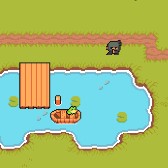

# Ninja Game

Welcome to **Ninja Game**, a retro pixel art, 2D top-down game where strategy and character selection are key to your success in battle against other players.

## About the Game

**Ninja Game** lets you dive into an engaging pixel art world where you pick your ninja character, each with unique stats and abilities, and battle it out with other players in a strategic, top-down arena. Your goal is simple: outsmart and defeat your opponents to become the ultimate ninja warrior.

## Features

- **Pick Your Ninja:** Choose from a variety of characters, each with unique stats and skills.
- **Battle Other Players:** Engage in strategic battles in a top-down 2D arena.
- **Retro Pixel Art Style:** Immerse yourself in a beautifully crafted pixel art world.
- **Competitive Gameplay:** Fight your way up the leaderboard and prove your skills.

## Game Protocol

For detailed information about the game protocol, mechanics, and character stats, please refer to our [Game Protocol Document](https://docs.google.com/document/d/1q0YtpxmVeLM1GJJ6J4Jqb-wRUAMRFzKgyAiq9oT_lgk/edit?usp=sharing).

Enjoy playing **Ninja Game** and become the ultimate ninja warrior!
